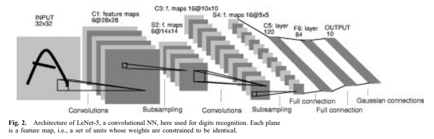

# LeNet PyTorch Implementation

## Introduction

This is a PyTorch implementation of the LeNet architecture. The LeNet architecture was first introduced by Yann LeCun in 1998. It was designed to classify handwritten digits. The architecture consists of 7 layers, including 3 convolutional layers and 2 fully connected layers. The architecture is as follows:

## Reference

- [Gradient-based learning applied to document recognition | IEEE Journals & Magazine | IEEE Xplore](https://ieeexplore.ieee.org/document/726791)
- [activatedgeek/LeNet-5: PyTorch implementation of LeNet-5 with live visualization (github.com)](https://github.com/activatedgeek/LeNet-5/tree/master)
